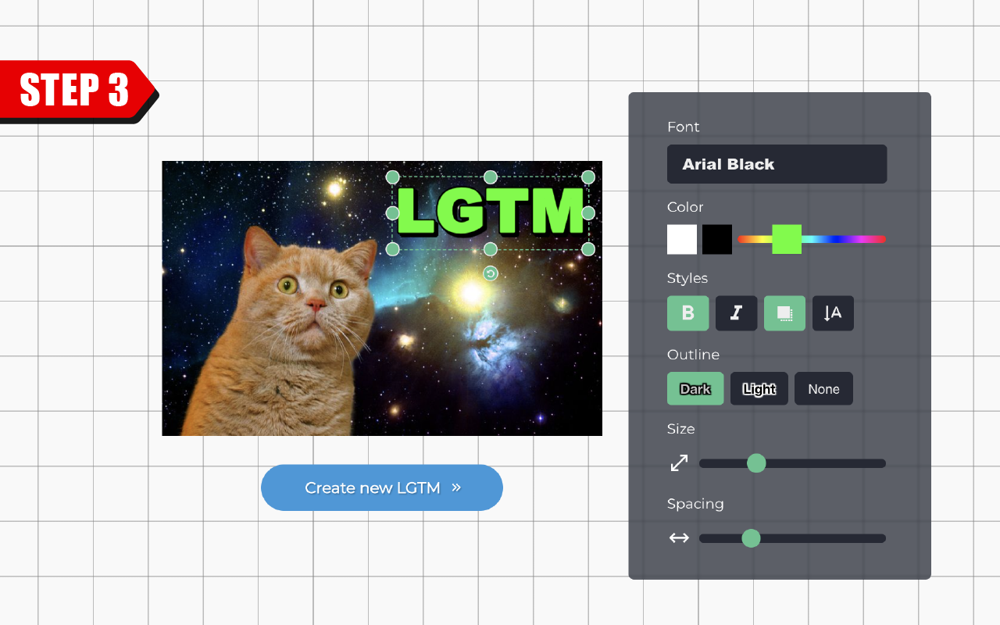

# LGTM.party invitation

This is a Chrome Extension for https://lgtm.party

Available at [Chrome Web Store](https://chrome.google.com/webstore/detail/noiladlnijnleongbajnlmbdchdoklpe/)

# Usage
### 1. Find the image you want to invite.  

### 2. Right-click on the image and select "Invite to LGTM.party".  

### 3. You can enjoy decorating it.  

### 4. Share the Markdown URL with your teammates!  

# Contributing
Pointing out mistakes in English grammar and expressions is also welcome.  
(I am not very good at English.)
